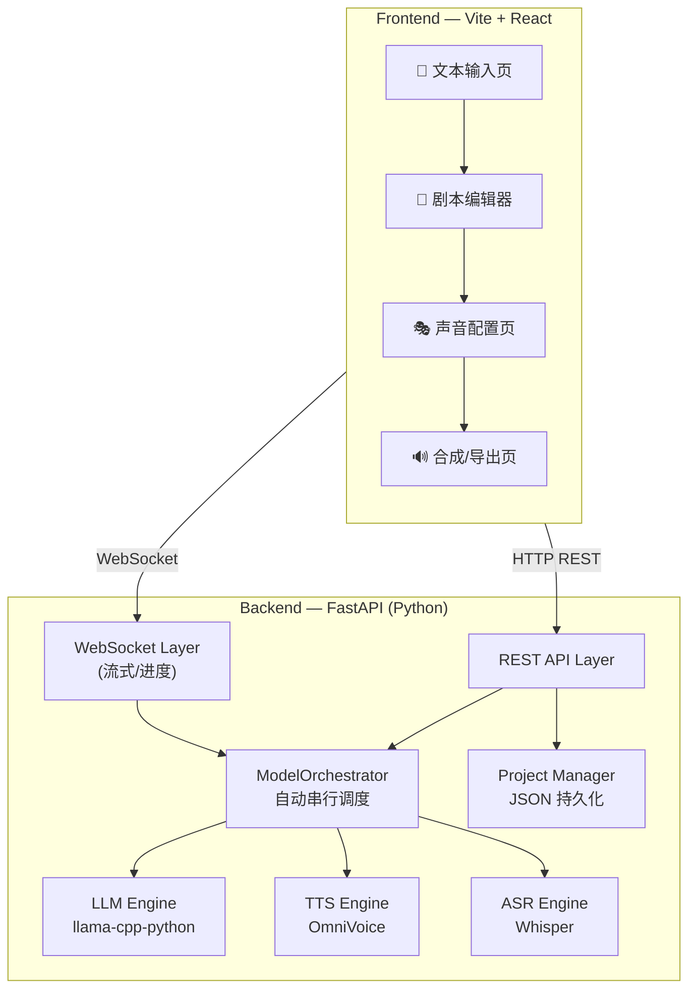
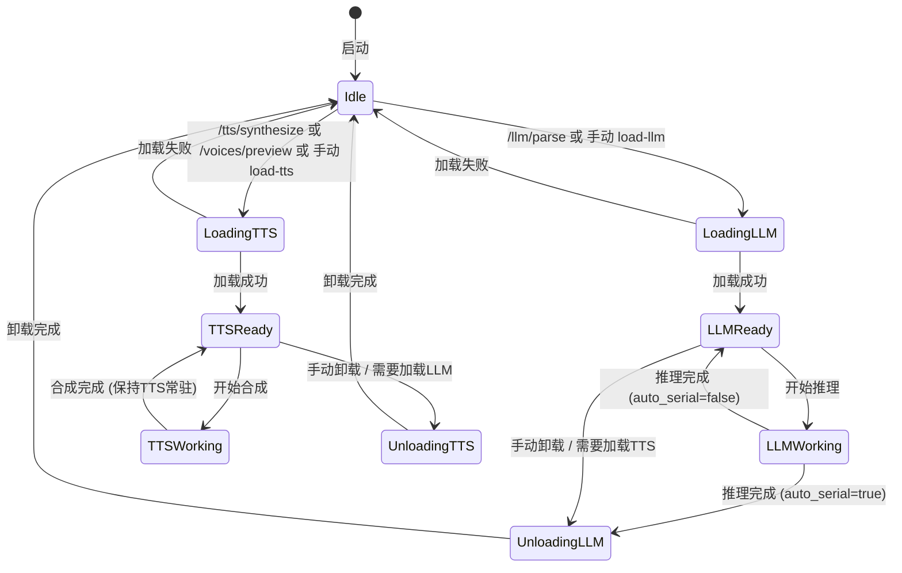
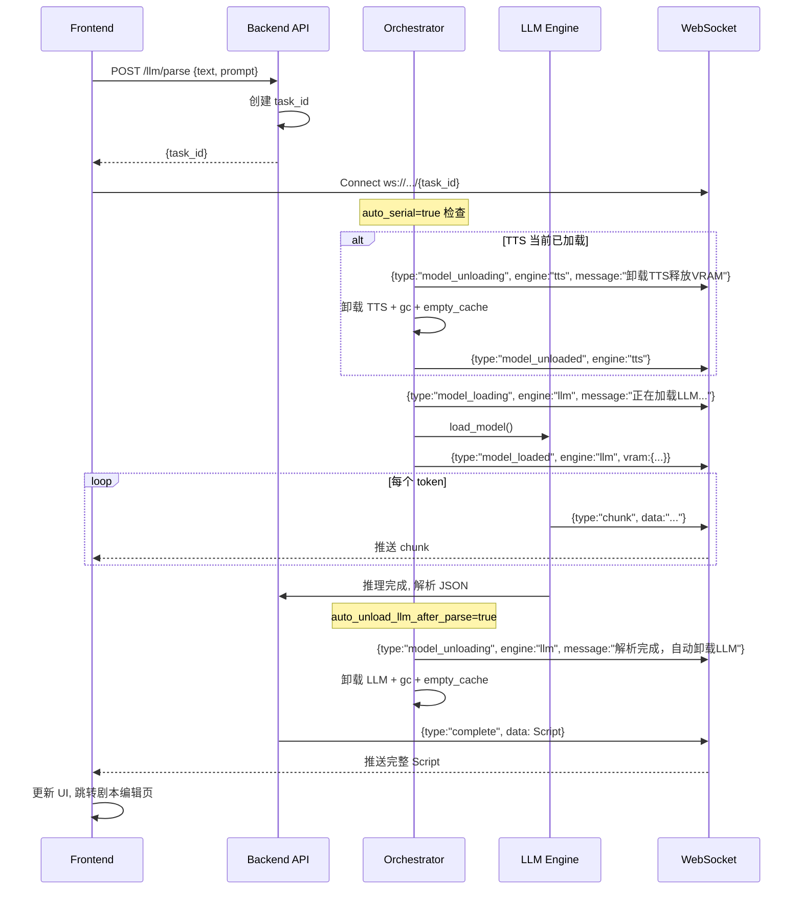
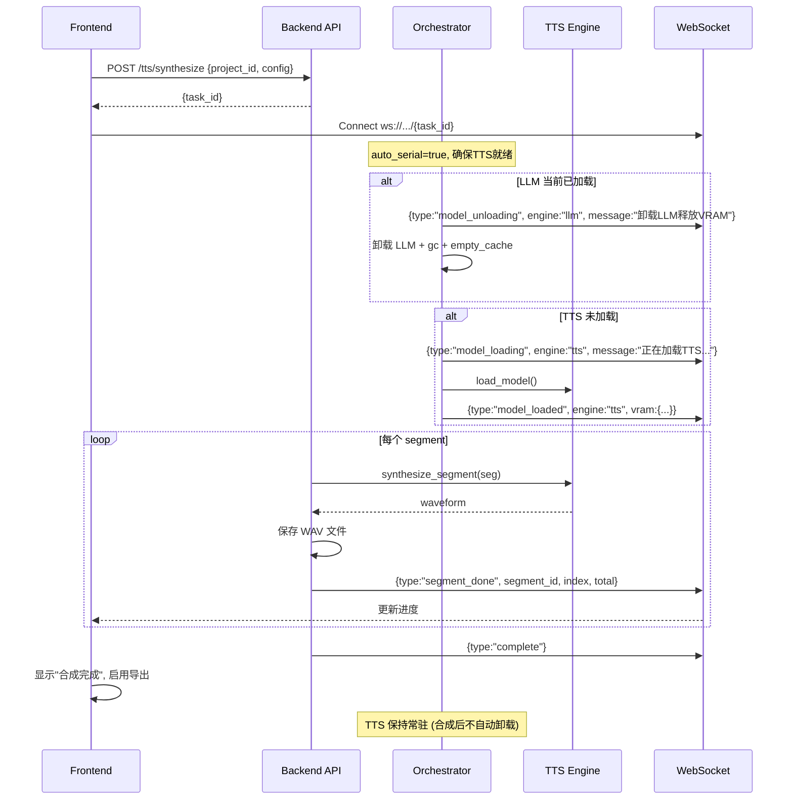

# BeautyVoiceTTS — 多角色有声书 TTS 系统 (前后端分离)

从文本到多角色有声书的全本地 AI 系统。LLM 解析 → 剧本审阅 → 声音配置 → TTS 合成。

## 系统架构概览



---

## 技术栈决策

| 层 | 技术 | 理由 |
|---|------|------|
| **Frontend 框架** | **Vite + React 19** | 极速 HMR；本地运行无需 SSR；React 生态组件丰富 |
| **前端状态管理** | **Zustand** | 轻量(<1KB)；无 Provider 嵌套；适合中等复杂度 |
| **样式** | **Vanilla CSS (CSS Modules)** | 最大灵活度；自定义暗色主题 + glassmorphism |
| **音频播放** | **WaveSurfer.js** | 波形可视化；分段音频；缩放/选区 |
| **富文本/剧本编辑** | **Custom React 组件** | 专为剧本格式定制的可编辑表格 |
| **图标** | **Lucide React** | 一致性 SVG 图标库；轻量按需加载 |
| **HTTP 客户端** | **fetch API** | 原生够用；WebSocket 原生 API |
| **Backend 框架** | **FastAPI** | 原生 async；自动 OpenAPI 文档；WebSocket 支持 |
| **LLM 推理** | **JamePeng/llama-cpp-python** | 用户指定；GGUF 模型；CUDA/CPU |
| **TTS** | **k2-fsa/OmniVoice** | 用户指定；600+ 语言；克隆/设计 |
| **ASR** | **OmniVoice 内置 Whisper** | 语音克隆参考音频自动转写 |
| **数据持久化** | **JSON 文件** | 项目/角色/剧本配置；无需数据库 |

---

## 目录结构

```
BeautyVoiceTTS/
├── backend/                          # Python FastAPI 后端
│   ├── main.py                       # FastAPI 入口 & uvicorn 启动
│   ├── config.py                     # 全局配置 dataclass
│   ├── requirements.txt              # Python 依赖
│   │
│   ├── api/                          # API 路由层
│   │   ├── __init__.py
│   │   ├── router.py                 # 路由聚合
│   │   ├── llm_routes.py             # LLM 解析相关接口
│   │   ├── tts_routes.py             # TTS 合成相关接口
│   │   ├── voice_routes.py           # 声音管理接口
│   │   ├── project_routes.py         # 项目管理接口
│   │   └── ws_routes.py              # WebSocket 端点
│   │
│   ├── engine/                       # 核心引擎层
│   │   ├── __init__.py
│   │   ├── model_orchestrator.py     # 模型生命周期调度 (自动串行)
│   │   ├── llm_engine.py             # LLM 推理封装
│   │   ├── tts_engine.py             # OmniVoice TTS 封装
│   │   ├── voice_manager.py          # 声音预设管理
│   │   └── prompts.py                # 默认/内置提示词
│   │
│   ├── models/                       # 数据模型层
│   │   ├── __init__.py
│   │   ├── script.py                 # Script/Segment/Character Pydantic models
│   │   ├── voice.py                  # VoiceProfile/VoicePreset models
│   │   ├── project.py                # Project model
│   │   └── api_models.py             # Request/Response schemas
│   │
│   └── data/                         # 运行时数据目录
│       ├── projects/                 # 项目数据 (JSON)
│       ├── voices/                   # 声音预设 & 参考音频
│       └── output/                   # 合成输出音频
│
├── frontend/                         # Vite + React 前端
│   ├── index.html
│   ├── package.json
│   ├── vite.config.js
│   │
│   ├── public/
│   │   └── favicon.svg
│   │
│   └── src/
│       ├── main.jsx                  # React 入口
│       ├── App.jsx                   # 根组件 + 路由
│       ├── index.css                 # 全局样式 & CSS 变量
│       │
│       ├── styles/                   # CSS Modules
│       │   ├── variables.css         # 设计令牌
│       │   ├── layout.module.css     # 布局
│       │   ├── sidebar.module.css    # 侧栏
│       │   ├── textInput.module.css  # 文本输入页
│       │   ├── scriptEditor.module.css  # 剧本编辑器
│       │   ├── voiceConfig.module.css   # 声音配置
│       │   ├── synthesis.module.css  # 合成页
│       │   └── components.module.css # 共享组件
│       │
│       ├── pages/                    # 页面组件
│       │   ├── TextInputPage.jsx     # 1. 文本输入 & LLM 解析
│       │   ├── ScriptEditorPage.jsx  # 2. 剧本审阅/编辑
│       │   ├── VoiceConfigPage.jsx   # 3. 角色声音配置
│       │   └── SynthesisPage.jsx     # 4. 合成 & 导出
│       │
│       ├── components/               # 可复用组件
│       │   ├── layout/
│       │   │   ├── Sidebar.jsx       # 侧导航
│       │   │   ├── Header.jsx        # 顶栏
│       │   │   └── PageContainer.jsx # 页面容器
│       │   │
│       │   ├── text/
│       │   │   ├── TextEditor.jsx    # 大文本编辑器
│       │   │   ├── FileUploader.jsx  # 文件拖拽上传
│       │   │   └── PromptEditor.jsx  # 提示词编辑器
│       │   │
│       │   ├── script/
│       │   │   ├── ScriptViewer.jsx         # 剧本可视化视图
│       │   │   ├── SegmentCard.jsx          # 单段卡片(旁白/对话)
│       │   │   ├── SegmentEditModal.jsx     # 段落编辑弹窗
│       │   │   ├── CharacterTagList.jsx     # 角色标签列表
│       │   │   └── ScriptToolbar.jsx        # 剧本操作工具栏
│       │   │
│       │   ├── voice/
│       │   │   ├── VoiceCard.jsx            # 角色声音卡片
│       │   │   ├── VoiceClonePanel.jsx      # 声音克隆面板
│       │   │   ├── VoiceDesignPanel.jsx     # 声音设计面板
│       │   │   ├── AudioUploader.jsx        # 参考音频上传
│       │   │   └── VoicePresetManager.jsx   # 预设管理
│       │   │
│       │   ├── synthesis/
│       │   │   ├── SynthesisControls.jsx    # 合成参数面板
│       │   │   ├── ProgressTracker.jsx      # 进度追踪器
│       │   │   ├── AudioTimeline.jsx        # 音频时间线
│       │   │   └── ExportPanel.jsx          # 导出面板
│       │   │
│       │   └── shared/
│       │       ├── AudioPlayer.jsx          # 波形音频播放器
│       │       ├── GlassCard.jsx            # Glassmorphism 卡片
│       │       ├── StatusBadge.jsx          # 状态标签
│       │       ├── ProgressBar.jsx          # 进度条
│       │       ├── Toast.jsx               # 通知提示
│       │       ├── Modal.jsx               # 模态弹窗
│       │       ├── Dropdown.jsx            # 下拉选择
│       │       ├── Slider.jsx              # 滑块
│       │       └── IconButton.jsx          # 图标按钮
│       │
│       ├── stores/                   # Zustand 状态管理
│       │   ├── useProjectStore.js    # 项目状态
│       │   ├── useScriptStore.js     # 剧本状态
│       │   ├── useVoiceStore.js      # 声音配置状态
│       │   ├── useSynthesisStore.js  # 合成状态
│       │   └── useSettingsStore.js   # 全局设置
│       │
│       ├── hooks/                    # 自定义 Hooks
│       │   ├── useWebSocket.js       # WebSocket 连接管理
│       │   ├── useApi.js             # REST API 调用封装
│       │   └── useAudioPlayer.js     # 音频播放器逻辑
│       │
│       └── utils/
│           ├── api.js                # API base URL & fetch 封装
│           ├── constants.js          # 常量定义
│           └── formatters.js         # 格式化工具
│
├── start.py                          # 一键启动脚本 (后端+前端)
└── README.md
```

---

## 一、Backend API 设计

### 1.1 API 概览

Base URL: `http://localhost:8000/api/v1`

| 方法 | 端点 | 说明 | 请求体 | 响应 |
|------|------|------|--------|------|
| **系统 & 模型调度** | | | | |
| `GET` | `/system/status` | 系统状态（模型、VRAM、调度模式） | — | `SystemStatus` |
| `GET` | `/system/gpu-info` | GPU 显存使用详情 | — | `GpuInfo` |
| `PUT` | `/system/orchestrator/config` | 更新调度器配置 | `OrchestratorConfig` | `OrchestratorConfig` |
| `POST` | `/system/load-llm` | 手动加载 LLM 模型 | `{model_path, n_ctx, n_gpu_layers}` | `{status}` |
| `POST` | `/system/unload-llm` | 手动卸载 LLM 释放 VRAM | — | `{status}` |
| `POST` | `/system/load-tts` | 手动加载 OmniVoice 模型 | `{model_path, device}` | `{status}` |
| `POST` | `/system/unload-tts` | 手动卸载 TTS 释放 VRAM | — | `{status}` |
| **LLM 解析** | | | | |
| `POST` | `/llm/parse` | 启动文本→剧本解析任务 (自动串行: 自动加载LLM，完成后自动卸载) | `ParseRequest` | `{task_id}` |
| `GET` | `/llm/parse/{task_id}` | 查询解析任务结果 | — | `Script` |
| `GET` | `/llm/prompts/default` | 获取默认提示词 | — | `{prompt}` |
| **项目** | | | | |
| `GET` | `/projects` | 列出所有项目 | — | `Project[]` |
| `POST` | `/projects` | 创建新项目 | `{name}` | `Project` |
| `GET` | `/projects/{id}` | 获取项目详情 | — | `Project` |
| `PUT` | `/projects/{id}` | 更新项目 | `Project` | `Project` |
| `DELETE` | `/projects/{id}` | 删除项目 | — | `{status}` |
| **剧本** | | | | |
| `GET` | `/projects/{id}/script` | 获取项目剧本 | — | `Script` |
| `PUT` | `/projects/{id}/script` | 更新完整剧本 | `Script` | `Script` |
| `PUT` | `/projects/{id}/script/segments/{seg_id}` | 更新单个片段 | `Segment` | `Segment` |
| `POST` | `/projects/{id}/script/segments` | 添加片段 | `Segment` | `Segment` |
| `DELETE` | `/projects/{id}/script/segments/{seg_id}` | 删除片段 | — | `{status}` |
| `POST` | `/projects/{id}/script/reorder` | 重新排序 | `{segment_ids[]}` | `Script` |
| **声音** | | | | |
| `GET` | `/voices/presets` | 列出所有声音预设 | — | `VoicePreset[]` |
| `POST` | `/voices/presets` | 创建声音预设 | `VoicePreset` | `VoicePreset` |
| `PUT` | `/voices/presets/{id}` | 更新声音预设 | `VoicePreset` | `VoicePreset` |
| `DELETE` | `/voices/presets/{id}` | 删除声音预设 | — | `{status}` |
| `POST` | `/voices/upload-ref` | 上传参考音频 | `multipart/form-data` | `{file_path, duration}` |
| `POST` | `/voices/transcribe` | ASR 转写参考音频 (自动串行: 先确保TTS已加载) | `{audio_path}` | `{text}` |
| `POST` | `/voices/preview` | 试听声音 (自动串行: 先确保TTS已加载) | `VoicePreviewRequest` | `audio/wav` (binary) |
| **TTS 合成** | | | | |
| `POST` | `/tts/synthesize` | 启动整本合成 (自动串行: 自动卸载LLM、加载TTS) | `SynthesizeRequest` | `{task_id}` |
| `GET` | `/tts/synthesize/{task_id}` | 查询合成任务状态 | — | `SynthesisStatus` |
| `GET` | `/tts/synthesize/{task_id}/audio/{seg_id}` | 获取已合成的单段音频 | — | `audio/wav` |
| `POST` | `/tts/export` | 导出拼接后完整音频 | `ExportRequest` | `audio/wav` |
| **文件浏览** | | | | |
| `POST` | `/files/browse` | 本地文件浏览器(选GGUF等) | `{path, filter}` | `FileEntry[]` |

### 1.2 WebSocket 端点

| 端点 | 说明 | 消息类型 |
|------|------|---------|
| `ws://localhost:8000/ws/llm-stream/{task_id}` | LLM 解析流式输出 | `{type: "model_loading"/"model_loaded"/"chunk"/"progress"/"model_unloading"/"complete"/"error", data}` |
| `ws://localhost:8000/ws/tts-progress/{task_id}` | TTS 合成进度推送 | `{type: "model_loading"/"model_loaded"/"segment_start"/"segment_done"/"complete"/"error", segment_id, progress}` |
| `ws://localhost:8000/ws/system-events` | 系统事件 (模型加卸载通知) | `{type: "model_state_changed", engine: "llm"/"tts", state, vram}` |

### 1.3 核心数据模型 (Pydantic)

```python
# === models/script.py ===

class Segment(BaseModel):
    id: str                           # UUID
    index: int                        # 排序序号
    type: Literal["narration", "dialogue", "direction"]
    speaker: str                      # 角色名，旁白为 "narrator"
    text: str                         # 台词/旁白文本
    emotion: str = "neutral"          # 情感标签
    non_verbal: list[str] = []        # ["[laughter]", "[sigh]"] 等
    tts_overrides: dict = {}          # 针对此段的 TTS 参数覆盖 {speed, duration, ...}

class Character(BaseModel):
    name: str                         # 角色名
    description: str = ""             # 角色描述 (LLM 生成)
    appearance_count: int = 0         # 出场次数
    voice_preset_id: str | None = None  # 关联的声音预设 ID

class Script(BaseModel):
    title: str = ""
    source_text: str = ""             # 原始文本 (可选保存)
    segments: list[Segment] = []
    characters: list[Character] = []
    metadata: dict = {}               # 自由元数据


# === models/voice.py ===

class VoicePreset(BaseModel):
    id: str                           # UUID
    name: str                         # 预设名称
    voice_mode: Literal["clone", "design", "auto"]
    # Voice Clone
    ref_audio_path: str | None = None
    ref_text: str | None = None
    # Voice Design
    gender: str | None = None         # "male" / "female"
    age: str | None = None            # "child" / "teenager" / "young adult" / ...
    pitch: str | None = None          # "low pitch" / "high pitch" / ...
    style: str | None = None          # "whisper"
    accent: str | None = None         # "british accent" / ...
    dialect: str | None = None        # "四川话" / ...
    custom_instruct: str | None = None  # 自由 instruct 文本
    # 通用
    speed: float = 1.0
    description: str = ""

    def to_instruct_string(self) -> str:
        """将属性组装为 OmniVoice instruct 字符串"""
        parts = [v for v in [self.gender, self.age, self.pitch,
                             self.style, self.accent, self.dialect] if v]
        if self.custom_instruct:
            parts.append(self.custom_instruct)
        return ", ".join(parts) if parts else ""


# === models/project.py ===

class Project(BaseModel):
    id: str                           # UUID
    name: str
    created_at: datetime
    updated_at: datetime
    script: Script = Script()
    voice_assignments: dict[str, str] = {}  # character_name -> voice_preset_id
    synthesis_config: SynthesisConfig = SynthesisConfig()
    status: Literal["draft", "parsed", "voices_configured", "synthesizing", "done"] = "draft"

class SynthesisConfig(BaseModel):
    num_step: int = 32
    guidance_scale: float = 2.0
    denoise: bool = True
    gap_duration_ms: int = 500        # 段间静音(毫秒)
    output_format: Literal["wav", "mp3"] = "wav"
```

### 1.4 ModelOrchestrator — 自动串行 VRAM 调度

> [!IMPORTANT]
> **核心设计**: `ModelOrchestrator` 是后端的中央模型生命周期管理器。它在同一时间只允许一组兼容的模型占用 GPU，当工作流阶段切换时自动执行 **卸载→清理→加载** 的转换。所有需要 GPU 模型的 API 端点都通过 Orchestrator 请求模型，而非直接操作引擎。

#### 状态机



#### 完整代码设计

```python
# === engine/model_orchestrator.py ===

import asyncio
import gc
import logging
from dataclasses import dataclass, field
from enum import Enum
from typing import Any, Callable

import torch

logger = logging.getLogger(__name__)


class ModelState(str, Enum):
    IDLE = "idle"                    # 无模型加载
    LOADING_LLM = "loading_llm"      # 正在加载 LLM
    LLM_READY = "llm_ready"          # LLM 已就绪
    LLM_WORKING = "llm_working"      # LLM 推理中
    UNLOADING_LLM = "unloading_llm"  # 正在卸载 LLM
    LOADING_TTS = "loading_tts"      # 正在加载 TTS
    TTS_READY = "tts_ready"          # TTS 已就绪
    TTS_WORKING = "tts_working"      # TTS 合成中
    UNLOADING_TTS = "unloading_tts"  # 正在卸载 TTS


@dataclass
class OrchestratorConfig:
    auto_serial: bool = True         # 是否启用自动串行模式
    auto_unload_llm_after_parse: bool = True   # 解析完自动卸载 LLM
    auto_load_tts_before_synth: bool = True     # 合成前自动加载 TTS
    llm_model_path: str = ""         # 记住的 LLM 模型路径
    llm_n_ctx: int = 8192
    llm_n_gpu_layers: int = -1
    tts_model_path: str = "k2-fsa/OmniVoice"
    tts_device: str = "cuda:0"


@dataclass
class GpuInfo:
    device_name: str = ""
    total_vram_mb: int = 0
    used_vram_mb: int = 0
    free_vram_mb: int = 0


class ModelOrchestrator:
    """
    中央模型生命周期调度器。

    核心职责:
    1. 维护模型状态机 (state)
    2. 在自动串行模式下, 按需 卸载冲突模型 → 加载目标模型
    3. 广播状态变化事件给前端 (通过 on_state_change 回调)
    4. 提供 GPU 内存查询
    5. 线程安全: 使用 asyncio.Lock 防止并发加载/卸载
    """

    def __init__(self, llm_engine, tts_engine):
        self._llm = llm_engine
        self._tts = tts_engine
        self._state = ModelState.IDLE
        self._lock = asyncio.Lock()
        self._config = OrchestratorConfig()
        self._event_listeners: list[Callable] = []

    # ── 属性 ──

    @property
    def state(self) -> ModelState:
        return self._state

    @property
    def config(self) -> OrchestratorConfig:
        return self._config

    # ── 事件系统 ──

    def add_listener(self, callback: Callable):
        """注册状态变更监听器 (用于 WebSocket 广播)"""
        self._event_listeners.append(callback)

    async def _set_state(self, new_state: ModelState):
        old_state = self._state
        self._state = new_state
        event = {
            "type": "model_state_changed",
            "old_state": old_state.value,
            "new_state": new_state.value,
            "llm_loaded": self._llm.is_loaded,
            "tts_loaded": self._tts.is_loaded,
            "vram": self.get_gpu_info().__dict__,
        }
        for listener in self._event_listeners:
            try:
                await listener(event)
            except Exception:
                pass

    # ── GPU 信息 ──

    def get_gpu_info(self) -> GpuInfo:
        if not torch.cuda.is_available():
            return GpuInfo(device_name="CPU only")
        dev = torch.cuda.current_device()
        total = torch.cuda.get_device_properties(dev).total_mem // (1024 * 1024)
        used = torch.cuda.memory_allocated(dev) // (1024 * 1024)
        return GpuInfo(
            device_name=torch.cuda.get_device_name(dev),
            total_vram_mb=total,
            used_vram_mb=used,
            free_vram_mb=total - used,
        )

    def _force_gc(self):
        """强制垃圾回收 + 清理 CUDA 缓存"""
        gc.collect()
        if torch.cuda.is_available():
            torch.cuda.empty_cache()
            torch.cuda.synchronize()

    # ── 核心调度方法 ──

    async def ensure_llm_ready(self, on_status: Callable = None) -> None:
        """
        确保 LLM 已加载并可用。
        如果 TTS 当前占用 GPU 且 auto_serial=True，先卸载 TTS。
        """
        async with self._lock:
            if self._llm.is_loaded:
                return  # 已就绪

            # 如果 TTS 在占用 GPU，先卸载
            if self._tts.is_loaded:
                if not self._config.auto_serial:
                    raise RuntimeError(
                        "TTS 模型占用 GPU，手动模式下请先卸载 TTS 再加载 LLM"
                    )
                if on_status:
                    await on_status({"type": "model_unloading", "engine": "tts",
                                     "message": "正在卸载 TTS 模型以释放 VRAM..."})
                await self._set_state(ModelState.UNLOADING_TTS)
                self._tts.unload_model()
                self._force_gc()
                await self._set_state(ModelState.IDLE)

            # 加载 LLM
            if on_status:
                await on_status({"type": "model_loading", "engine": "llm",
                                 "message": f"正在加载 LLM: {self._config.llm_model_path}"})
            await self._set_state(ModelState.LOADING_LLM)
            try:
                self._llm.load_model(
                    model_path=self._config.llm_model_path,
                    n_ctx=self._config.llm_n_ctx,
                    n_gpu_layers=self._config.llm_n_gpu_layers,
                )
                await self._set_state(ModelState.LLM_READY)
                if on_status:
                    await on_status({"type": "model_loaded", "engine": "llm",
                                     "message": "LLM 模型加载完成",
                                     "vram": self.get_gpu_info().__dict__})
            except Exception as e:
                await self._set_state(ModelState.IDLE)
                raise

    async def ensure_tts_ready(self, on_status: Callable = None) -> None:
        """
        确保 TTS 已加载并可用。
        如果 LLM 当前占用 GPU 且 auto_serial=True，先卸载 LLM。
        """
        async with self._lock:
            if self._tts.is_loaded:
                return  # 已就绪

            # 如果 LLM 在占用 GPU，先卸载
            if self._llm.is_loaded:
                if not self._config.auto_serial:
                    raise RuntimeError(
                        "LLM 模型占用 GPU，手动模式下请先卸载 LLM 再加载 TTS"
                    )
                if on_status:
                    await on_status({"type": "model_unloading", "engine": "llm",
                                     "message": "正在卸载 LLM 模型以释放 VRAM..."})
                await self._set_state(ModelState.UNLOADING_LLM)
                self._llm.unload_model()
                self._force_gc()
                await self._set_state(ModelState.IDLE)

            # 加载 TTS
            if on_status:
                await on_status({"type": "model_loading", "engine": "tts",
                                 "message": f"正在加载 TTS: {self._config.tts_model_path}"})
            await self._set_state(ModelState.LOADING_TTS)
            try:
                self._tts.load_model(
                    model_path=self._config.tts_model_path,
                    device=self._config.tts_device,
                )
                await self._set_state(ModelState.TTS_READY)
                if on_status:
                    await on_status({"type": "model_loaded", "engine": "tts",
                                     "message": "TTS 模型加载完成",
                                     "vram": self.get_gpu_info().__dict__})
            except Exception as e:
                await self._set_state(ModelState.IDLE)
                raise

    async def release_llm_if_auto(self, on_status: Callable = None) -> None:
        """
        如果 auto_unload_llm_after_parse=True，解析完成后自动卸载 LLM。
        """
        if not self._config.auto_unload_llm_after_parse:
            return
        async with self._lock:
            if self._llm.is_loaded:
                if on_status:
                    await on_status({"type": "model_unloading", "engine": "llm",
                                     "message": "解析完成，自动卸载 LLM 释放 VRAM..."})
                await self._set_state(ModelState.UNLOADING_LLM)
                self._llm.unload_model()
                self._force_gc()
                await self._set_state(ModelState.IDLE)
                if on_status:
                    await on_status({"type": "model_unloaded", "engine": "llm",
                                     "message": "LLM 已卸载",
                                     "vram": self.get_gpu_info().__dict__})

    # ── 系统状态快照 ──

    def get_status(self) -> dict:
        return {
            "state": self._state.value,
            "llm_loaded": self._llm.is_loaded,
            "llm_model_path": self._config.llm_model_path if self._llm.is_loaded else None,
            "tts_loaded": self._tts.is_loaded,
            "tts_model_path": self._config.tts_model_path if self._tts.is_loaded else None,
            "auto_serial": self._config.auto_serial,
            "gpu": self.get_gpu_info().__dict__,
        }
```

### 1.5 LLM Engine 设计细节

```python
# === engine/llm_engine.py ===

class LLMEngine:
    def __init__(self):
        self._model: Llama | None = None
        self._model_path: str = ""

    def load_model(self, model_path: str, n_ctx: int = 8192,
                   n_gpu_layers: int = -1) -> None:
        """加载 GGUF 模型到内存"""
        from llama_cpp import Llama
        self._model = Llama(
            model_path=model_path,
            n_ctx=n_ctx,
            n_gpu_layers=n_gpu_layers,
            verbose=False,
        )
        self._model_path = model_path

    def unload_model(self) -> None:
        """释放模型和 VRAM"""
        del self._model
        self._model = None
        import gc; gc.collect()
        torch.cuda.empty_cache()

    async def parse_text_to_script(
        self,
        text: str,
        system_prompt: str | None = None,
        on_chunk: Callable[[str], None] | None = None,
    ) -> Script:
        """
        核心方法: 文本 → Script

        1. 准备 system_prompt (默认或自定义)
        2. 构造 user_prompt (含原始文本)
        3. 调用 LLM 逐 token 推理 (streaming)
        4. 从 LLM 输出中提取 JSON
        5. 验证并返回 Script 对象
        """
        prompt = system_prompt or DEFAULT_SYSTEM_PROMPT
        messages = [
            {"role": "system", "content": prompt},
            {"role": "user", "content": f"请将以下文本解析为剧本格式:\n\n{text}"},
        ]
        # Streaming completion
        full_response = ""
        for chunk in self._model.create_chat_completion(
            messages=messages,
            stream=True,
            temperature=0.3,
            max_tokens=n_ctx - estimated_prompt_tokens,
        ):
            delta = chunk["choices"][0].get("delta", {}).get("content", "")
            full_response += delta
            if on_chunk:
                on_chunk(delta)

        # 提取 JSON 并解析为 Script
        script = self._extract_script_from_response(full_response)
        return script

    @property
    def is_loaded(self) -> bool:
        return self._model is not None
```

### 1.6 TTS Engine 设计细节

```python
# === engine/tts_engine.py ===

class TTSEngine:
    def __init__(self):
        self._model: OmniVoice | None = None
        self._voice_clone_cache: dict[str, Any] = {}  # preset_id -> voice_clone_prompt

    def load_model(self, model_path: str = "k2-fsa/OmniVoice",
                   device: str = "cuda:0") -> None:
        self._model = OmniVoice.from_pretrained(
            model_path, device_map=device, dtype=torch.float16
        )

    def unload_model(self) -> None:
        """释放 TTS 模型和 VRAM"""
        self._voice_clone_cache.clear()
        del self._model
        self._model = None
        import gc; gc.collect()
        torch.cuda.empty_cache()

    def synthesize_segment(
        self, text: str, voice_preset: VoicePreset,
        overrides: dict = {}
    ) -> tuple[np.ndarray, int]:
        """
        合成单个片段 → (waveform, sample_rate)

        根据 voice_mode:
        - clone: 使用缓存的 voice_clone_prompt
        - design: 使用 instruct 字符串
        - auto: 无参数自动生成
        """
        gen_config = OmniVoiceGenerationConfig(
            num_step=overrides.get("num_step", 32),
            guidance_scale=overrides.get("guidance_scale", 2.0),
            denoise=overrides.get("denoise", True),
        )

        kwargs = dict(text=text, generation_config=gen_config)

        if voice_preset.speed != 1.0:
            kwargs["speed"] = voice_preset.speed

        if voice_preset.voice_mode == "clone":
            clone_prompt = self._get_or_create_clone_prompt(voice_preset)
            kwargs["voice_clone_prompt"] = clone_prompt
        elif voice_preset.voice_mode == "design":
            kwargs["instruct"] = voice_preset.to_instruct_string()

        audio = self._model.generate(**kwargs)
        waveform = audio[0].squeeze(0).numpy()
        return waveform, self._model.sampling_rate

    def _get_or_create_clone_prompt(self, preset: VoicePreset):
        """缓存 voice_clone_prompt 避免每段重复计算"""
        if preset.id not in self._voice_clone_cache:
            self._voice_clone_cache[preset.id] = self._model.create_voice_clone_prompt(
                ref_audio=preset.ref_audio_path,
                ref_text=preset.ref_text,
            )
        return self._voice_clone_cache[preset.id]

    async def synthesize_script(
        self, script: Script, voice_assignments: dict,
        voice_presets: dict[str, VoicePreset],
        config: SynthesisConfig,
        on_progress: Callable | None = None,
    ) -> list[tuple[np.ndarray, int]]:
        """
        批量合成整个剧本
        - 按 segment 顺序逐段合成
        - 通过 on_progress 回调报告进度
        - 返回 [(waveform, sample_rate), ...] 列表
        """
        results = []
        total = len(script.segments)
        for i, seg in enumerate(script.segments):
            preset_id = voice_assignments.get(seg.speaker)
            preset = voice_presets.get(preset_id) if preset_id else None
            if preset is None:
                preset = VoicePreset(id="auto", name="Auto", voice_mode="auto")

            waveform, sr = self.synthesize_segment(
                text=seg.text, voice_preset=preset,
                overrides={"num_step": config.num_step, **seg.tts_overrides}
            )
            results.append((waveform, sr))

            if on_progress:
                on_progress(segment_id=seg.id, progress=(i+1)/total, index=i)

        return results

    @staticmethod
    def concat_with_gaps(segments: list[tuple[np.ndarray, int]],
                         gap_ms: int = 500) -> tuple[np.ndarray, int]:
        """拼接所有音频片段，段间插入静音"""
        sr = segments[0][1]
        gap_samples = int(sr * gap_ms / 1000)
        gap = np.zeros(gap_samples, dtype=np.float32)

        parts = []
        for i, (wav, _) in enumerate(segments):
            parts.append(wav)
            if i < len(segments) - 1:
                parts.append(gap)
        return np.concatenate(parts), sr

    @property
    def is_loaded(self) -> bool:
        return self._model is not None
```

### 1.7 默认提示词设计

```python
# === engine/prompts.py ===

DEFAULT_SYSTEM_PROMPT = """你是一个文本剧本化分析大师。请将用户提供的文本精确解析为 TTS 系统可直接消费的剧本 JSON 格式。

## 任务说明

1. **角色识别**: 识别所有出场角色，提取其姓名。
2. **旁白与对话分离**: 叙述/环境/心理/动作描写归为 narration，直接引语归为 dialogue，舞台指示归为 direction。
3. **声音画像**: 为每个角色推断声音特征（性别、年龄段、音调高低、口音/方言），使用以下可选值:
   - gender: "male", "female"
   - age: "child", "teenager", "young adult", "middle-aged", "elderly"
   - pitch: "very low pitch", "low pitch", "moderate pitch", "high pitch", "very high pitch"
   - style: "whisper" (仅在需要时)
   - accent(英文): "american accent", "british accent", "australian accent" 等
   - dialect(中文): "四川话", "东北话", "河南话" 等
4. **情感标注**: 为每段标注情感 (neutral, happy, sad, angry, excited, scared, surprised, tender, solemn)
5. **非语言标签**: 在合适的位置插入非语言标签: [laughter], [sigh], [confirmation-en], [question-en], [surprise-ah] 等

## 输出格式

严格输出以下 JSON 格式，不要输出任何其他内容:

```json
{
  "title": "文本标题或概要",
  "segments": [
    {
      "id": "seg_001",
      "index": 0,
      "type": "narration|dialogue|direction",
      "speaker": "角色名或narrator",
      "text": "文本内容（可含 [laughter] 等非语言标签）",
      "emotion": "neutral",
      "non_verbal": []
    }
  ],
  "characters": [
    {
      "name": "角色名",
      "description": "角色描述",
      "appearance_count": 5,
      "suggested_voice": {
        "gender": "male",
        "age": "young adult",
        "pitch": "moderate pitch",
        "style": null,
        "accent": null,
        "dialect": null
      }
    }
  ]
}
```

## 注意事项
- segment 的 text 字段应为纯文本，不含引号标记
- 旁白的 speaker 固定为 "narrator"
- 每段保持合理长度（不超过200字），过长需拆分
- 保持原文语义完整性，不要删减或改写内容
- 非语言标签直接嵌入 text 中对应位置
"""

# OmniVoice 支持的所有声音设计属性（用于 UI 下拉选项）
VOICE_DESIGN_ATTRIBUTES = {
    "gender": ["male", "female"],
    "age": ["child", "teenager", "young adult", "middle-aged", "elderly"],
    "pitch": ["very low pitch", "low pitch", "moderate pitch", "high pitch", "very high pitch"],
    "style": ["whisper"],
    "accent": [
        "american accent", "british accent", "australian accent",
        "canadian accent", "indian accent", "chinese accent",
        "korean accent", "japanese accent", "portuguese accent", "russian accent"
    ],
    "dialect": [
        "河南话", "陕西话", "四川话", "贵州话", "云南话", "桂林话",
        "济南话", "石家庄话", "甘肃话", "宁夏话", "青岛话", "东北话"
    ],
}

# 非语言标签（OmniVoice 支持）
NON_VERBAL_TAGS = [
    "[laughter]", "[sigh]", "[confirmation-en]",
    "[question-en]", "[question-ah]", "[question-oh]",
    "[question-ei]", "[question-yi]",
    "[surprise-ah]", "[surprise-oh]", "[surprise-wa]", "[surprise-yo]",
    "[dissatisfaction-hnn]"
]
```

---

## 二、Frontend 设计

### 2.1 设计系统 (Design Tokens)

```css
/* === styles/variables.css === */

:root {
  /* ── 色彩体系 (暗色主题) ── */
  --bg-primary: #0a0e1a;           /* 深空黑 */
  --bg-secondary: #111827;         /* 卡片背景 */
  --bg-tertiary: #1f2937;          /* 次级容器 */
  --bg-elevated: #374151;          /* 悬浮元素 */

  /* 品牌色 */
  --accent-primary: #818cf8;       /* 柔和靛蓝 */
  --accent-primary-hover: #6366f1;
  --accent-secondary: #06b6d4;     /* 青绿 */
  --accent-gradient: linear-gradient(135deg, #6366f1, #8b5cf6, #06b6d4);

  /* 语义色 */
  --color-success: #34d399;
  --color-warning: #fbbf24;
  --color-error: #f87171;
  --color-info: #60a5fa;

  /* 文字 */
  --text-primary: #f1f5f9;
  --text-secondary: #94a3b8;
  --text-muted: #64748b;
  --text-inverse: #0f172a;

  /* 边框 */
  --border-subtle: rgba(255, 255, 255, 0.06);
  --border-default: rgba(255, 255, 255, 0.1);
  --border-accent: rgba(99, 102, 241, 0.4);

  /* Glassmorphism */
  --glass-bg: rgba(17, 24, 39, 0.7);
  --glass-border: rgba(255, 255, 255, 0.08);
  --glass-blur: 16px;

  /* 角色色标 (给不同角色分配颜色) */
  --character-1: #818cf8;   /* 靛蓝 */
  --character-2: #f472b6;   /* 粉红 */
  --character-3: #34d399;   /* 翠绿 */
  --character-4: #fbbf24;   /* 琥珀 */
  --character-5: #f97316;   /* 橙色 */
  --character-6: #06b6d4;   /* 青绿 */
  --character-7: #a78bfa;   /* 紫蓝 */
  --character-8: #fb923c;   /* 浅橙 */
  --narrator-color: #94a3b8; /* 旁白: 银灰 */

  /* 圆角 */
  --radius-sm: 6px;
  --radius-md: 10px;
  --radius-lg: 16px;
  --radius-xl: 24px;

  /* 阴影 */
  --shadow-sm: 0 1px 3px rgba(0, 0, 0, 0.3);
  --shadow-md: 0 4px 12px rgba(0, 0, 0, 0.4);
  --shadow-lg: 0 8px 30px rgba(0, 0, 0, 0.5);
  --shadow-glow: 0 0 20px rgba(99, 102, 241, 0.15);

  /* 间距 */
  --space-xs: 4px;
  --space-sm: 8px;
  --space-md: 16px;
  --space-lg: 24px;
  --space-xl: 32px;
  --space-2xl: 48px;

  /* 动画 */
  --transition-fast: 150ms ease-out;
  --transition-normal: 250ms ease-out;
  --transition-slow: 400ms ease-out;

  /* 字体 */
  --font-heading: 'Poppins', 'Noto Sans SC', sans-serif;
  --font-body: 'Inter', 'Noto Sans SC', sans-serif;
  --font-mono: 'JetBrains Mono', 'Fira Code', monospace;
}
```

### 2.2 Google Fonts 导入

```css
@import url('https://fonts.googleapis.com/css2?family=Inter:wght@300;400;500;600;700&family=Poppins:wght@500;600;700&family=Noto+Sans+SC:wght@300;400;500;700&family=JetBrains+Mono:wght@400;500&display=swap');
```

### 2.3 页面布局

```
┌──────────────────────────────────────────────────────────┐
│                    Header (顶栏)                         │
│  🎙️ BeautyVoice TTS          [项目: xxx]  [⚙️ Settings] │
├────────┬─────────────────────────────────────────────────┤
│        │                                                 │
│  📝    │                                                 │
│ 文本   │              主内容区                            │
│  输入  │         (根据侧栏选中项渲染)                      │
│        │                                                 │
│  📜    │                                                 │
│ 剧本   │                                                 │
│  编辑  │                                                 │
│        │                                                 │
│  🎭    │                                                 │
│ 声音   │                                                 │
│  配置  │                                                 │
│        │                                                 │
│  🔊    │                                                 │
│ 合成   │                                                 │
│        │                                                 │
│        │                                                 │
│ ────── │                                                 │
│  ⚙️    │                                                 │
│ 设置   │                                                 │
│        │                                                 │
└────────┴─────────────────────────────────────────────────┘
```

> [!NOTE]
> 侧栏使用图标+短标签，宽度 72px 收起 / 220px 展开。选中项高亮并带 accent 左边框。

### 2.4 页面详细设计

#### 页面 1: 文本输入 (`TextInputPage`)

```
┌────────────────────────────────────────────────┐
│ [文本输入]                                      │
│                                                │
│ ┌──── 模型配置 (折叠面板) ────────────────────┐ │
│ │  LLM 模型路径: [/path/to/model.gguf] [浏览] │ │
│ │  上下文长度:   [8192 ▼]                      │ │
│ │  GPU Layers:   [  -1  ]  (全部卸载到GPU)     │ │
│ │  [加载模型]  [卸载模型]    状态: ✅ 已加载     │ │
│ └──────────────────────────────────────────────┘ │
│                                                │
│ ┌──── 文本输入 ──────────────────────────────┐ │
│ │                                            │ │
│ │  [拖拽上传 .txt / .md]                     │ │
│ │                                            │ │
│ │  ┌──────────────────────────────────────┐  │ │
│ │  │                                      │  │ │
│ │  │   (大文本编辑器, 约20行)              │  │ │
│ │  │                                      │  │ │
│ │  │                                      │  │ │
│ │  └──────────────────────────────────────┘  │ │
│ │  字数统计: 0                               │ │
│ └────────────────────────────────────────────┘ │
│                                                │
│ ┌──── 提示词 (折叠面板) ─────────────────────┐ │
│ │  ○ 使用默认提示词  ● 自定义提示词           │ │
│ │  ┌──────────────────────────────────────┐  │ │
│ │  │  (提示词编辑器, monospace 字体)       │  │ │
│ │  └──────────────────────────────────────┘  │ │
│ │  [重置为默认]                               │ │
│ └────────────────────────────────────────────┘ │
│                                                │
│ [🚀 解析为剧本]                                │
│                                                │
│ ┌──── 解析进度 (解析中可见) ─────────────────┐ │
│ │  ██████████░░░░░░  62%                     │ │
│ │  正在识别角色与对话...                       │ │
│ │  ┌──────────────────────────────────────┐  │ │
│ │  │  (LLM 流式输出实时显示)               │  │ │
│ │  └──────────────────────────────────────┘  │ │
│ └────────────────────────────────────────────┘ │
└────────────────────────────────────────────────┘
```

#### 页面 2: 剧本编辑器 (`ScriptEditorPage`)

```
┌────────────────────────────────────────────────────┐
│ [剧本编辑器]            [导入JSON] [导出JSON]       │
│                                                    │
│ ┌─── 工具栏 ──────────────────────────────────────┐│
│ │ 角色筛选: [全部▼] 搜索: [________]  [+添加片段] ││
│ └─────────────────────────────────────────────────┘│
│                                                    │
│ ┌─── 角色列表 (横向标签) ─────────────────────────┐│
│ │ [旁白] [贾宝玉] [林黛玉] [王熙凤] [+]           ││
│ └─────────────────────────────────────────────────┘│
│                                                    │
│ ┌─── 剧本内容 (可滚动) ──────────────────────────┐│
│ │                                                 ││
│ │  ┌─[ 旁白 ]──────────────────────── #001 ──┐   ││
│ │  │ 话说天下大势，分久必合合久必分...         │   ││
│ │  │                        neutral  [✏️][🗑️] │   ││
│ │  └──────────────────────────────────────────┘   ││
│ │                                                 ││
│ │  ┌─[●贾宝玉]─────────────────────── #002 ──┐   ││
│ │  │ "林妹妹，你可来了！我日日盼着你..."       │   ││
│ │  │                       excited   [✏️][🗑️] │   ││
│ │  └──────────────────────────────────────────┘   ││
│ │                                                 ││
│ │  ┌─[●林黛玉]─────────────────────── #003 ──┐   ││
│ │  │ "[sigh] 宝哥哥，我何尝不是..."           │   ││
│ │  │                         sad     [✏️][🗑️] │   ││
│ │  └──────────────────────────────────────────┘   ││
│ │                                                 ││
│ └─────────────────────────────────────────────────┘│
│                                                    │
│ 共 42 个片段 · 6 个角色                             │
└────────────────────────────────────────────────────┘

✏️ 编辑弹窗:
┌──── 编辑片段 #002 ──────────────────────────┐
│  类型: [对话 ▼]    角色: [贾宝玉 ▼]         │
│  文本:                                      │
│  ┌──────────────────────────────────────┐   │
│  │ 林妹妹，你可来了！我日日盼着你...     │   │
│  └──────────────────────────────────────┘   │
│  情感: [excited ▼]                          │
│  非语言标签: [+laughter] [+sigh] [+...]     │
│  速度覆盖: [1.0]                            │
│                         [取消] [保存]        │
└─────────────────────────────────────────────┘
```

#### 页面 3: 声音配置 (`VoiceConfigPage`)

```
┌────────────────────────────────────────────────────────┐
│ [声音配置]                         [声音预设管理]       │
│                                                        │
│ ┌─── 角色列表 ────────────────────────────────────────┐│
│ │                                                     ││
│ │  ┌─ 旁白 ──────────────────────────────────────┐   ││
│ │  │  描述: 沉稳男性旁白                          │   ││
│ │  │  模式: [● 设计] [○ 克隆] [○ 自动]            │   ││
│ │  │  ┌── Voice Design ─────────────────────┐    │   ││
│ │  │  │ 性别: [Male ▼]     年龄: [Middle-aged ▼] │   ││
│ │  │  │ 音调: [Moderate ▼] 风格: [— ▼]          │   ││
│ │  │  │ 口音: [— ▼]       方言: [— ▼]           │   ││
│ │  │  │ 自定义: [________________]               │   ││
│ │  │  │ 速度: ──●────── 1.0x                     │   ││
│ │  │  └─────────────────────────────────────┘    │   ││
│ │  │  [🔊 试听]  [💾 保存预设]                    │   ││
│ │  │  🔊 ▶ ───■──────── 0:03/0:05               │   ││
│ │  └──────────────────────────────────────────────┘   ││
│ │                                                     ││
│ │  ┌─ 贾宝玉 ────────────────────────────────────┐   ││
│ │  │  描述: 少年公子，声音清朗                     │   ││
│ │  │  模式: [○ 设计] [● 克隆] [○ 自动]            │   ││
│ │  │  ┌── Voice Clone ──────────────────────┐    │   ││
│ │  │  │ 参考音频: [拖拽上传或点击选择]          │   ││
│ │  │  │ ▶ ─────■────── 0:02/0:08             │   ││
│ │  │  │ 参考文本: [有声音转写文本...]  [ASR转写] │   ││
│ │  │  │ 速度: ──●────── 1.0x                  │   ││
│ │  │  └─────────────────────────────────────┘    │   ││
│ │  │  [🔊 试听]  [💾 保存预设]                    │   ││
│ │  └──────────────────────────────────────────────┘   ││
│ │                                                     ││
│ └─────────────────────────────────────────────────────┘│
└────────────────────────────────────────────────────────┘
```

#### 页面 4: 合成 & 导出 (`SynthesisPage`)

```
┌────────────────────────────────────────────────────────┐
│ [语音合成]                                              │
│                                                        │
│ ┌─── 合成参数 ────────────────────────────────────────┐│
│ │ 推理步数: ──●────── 32    CFG Scale: ──●── 2.0      ││
│ │ 去噪: [☑]  段间静音: [500]ms   格式: [WAV ▼]       ││
│ └─────────────────────────────────────────────────────┘│
│                                                        │
│ [🚀 开始合成]  [⏸️ 暂停]  [⏹️ 停止]                    │
│                                                        │
│ ┌─── 合成进度 ────────────────────────────────────────┐│
│ │ 总进度: ████████████░░░░░ 23/42 段 (55%)            ││
│ │ 当前: 片段 #024 [贾宝玉] "林妹妹..."               ││
│ │ 耗时: 02:15  预计剩余: 01:50                        ││
│ └─────────────────────────────────────────────────────┘│
│                                                        │
│ ┌─── 分段预览 (可滚动) ──────────────────────────────┐│
│ │ #001 [旁白]    "话说天下..."  ✅  ▶ ───── 0:05     ││
│ │ #002 [贾宝玉]  "林妹妹，你..." ✅  ▶ ───── 0:04    ││
│ │ #003 [林黛玉]  "[sigh] 宝哥." ✅  ▶ ───── 0:03     ││
│ │ #004 [旁白]    "言罢，黛玉..." ⏳  ...              ││
│ │ #005 [王熙凤]  "哎哟哟！..."  ⬜  —                 ││
│ │ ...                                                 ││
│ └─────────────────────────────────────────────────────┘│
│                                                        │
│ ┌─── 完整音频预览 ───────────────────────────────────┐│
│ │  ▶ ════════════■══════════════════ 02:34/08:20      ││
│ │  [波形可视化 - WaveSurfer.js]                       ││
│ └─────────────────────────────────────────────────────┘│
│                                                        │
│ [📥 导出完整音频] [📥 分段导出 (ZIP)]                   │
└────────────────────────────────────────────────────────┘
```

### 2.5 关键组件详细设计

#### GlassCard 组件

```jsx
// 所有卡片的基础容器，实现 glassmorphism 效果
function GlassCard({ children, className, hoverable = false, ...props }) {
  return (
    <div
      className={`${styles.glassCard} ${hoverable ? styles.hoverable : ''} ${className}`}
      {...props}
    >
      {children}
    </div>
  );
}
```

```css
.glassCard {
  background: var(--glass-bg);
  backdrop-filter: blur(var(--glass-blur));
  -webkit-backdrop-filter: blur(var(--glass-blur));
  border: 1px solid var(--glass-border);
  border-radius: var(--radius-lg);
  box-shadow: var(--shadow-md);
  transition: all var(--transition-normal);
}

.hoverable:hover {
  border-color: var(--border-accent);
  box-shadow: var(--shadow-glow);
  transform: translateY(-1px);
}
```

#### SegmentCard 组件 (剧本片段卡片)

```jsx
function SegmentCard({ segment, characterColor, onEdit, onDelete }) {
  const isNarration = segment.type === 'narration';

  return (
    <div
      className={styles.segmentCard}
      style={{ '--char-color': characterColor }}
    >
      <div className={styles.segmentHeader}>
        <span
          className={styles.speakerTag}
          style={{ backgroundColor: `${characterColor}20`, color: characterColor }}
        >
          {isNarration ? '旁白' : segment.speaker}
        </span>
        <span className={styles.segmentId}>#{segment.id}</span>
      </div>
      <p className={`${styles.segmentText} ${isNarration ? styles.narration : ''}`}>
        {segment.text}
      </p>
      <div className={styles.segmentFooter}>
        <StatusBadge label={segment.emotion} />
        {segment.non_verbal.map(tag => (
          <span key={tag} className={styles.nonVerbalTag}>{tag}</span>
        ))}
        <div className={styles.segmentActions}>
          <IconButton icon={Edit2} onClick={() => onEdit(segment)} />
          <IconButton icon={Trash2} onClick={() => onDelete(segment.id)} />
        </div>
      </div>
    </div>
  );
}
```

#### AudioPlayer 组件 (WaveSurfer.js 封装)

```jsx
function AudioPlayer({ audioUrl, height = 60, showTimeline = false }) {
  const containerRef = useRef(null);
  const wavesurferRef = useRef(null);
  const [isPlaying, setIsPlaying] = useState(false);
  const [currentTime, setCurrentTime] = useState(0);
  const [duration, setDuration] = useState(0);

  useEffect(() => {
    if (!containerRef.current || !audioUrl) return;

    const ws = WaveSurfer.create({
      container: containerRef.current,
      waveColor: '#94a3b8',
      progressColor: '#818cf8',
      cursorColor: '#06b6d4',
      height,
      barWidth: 2,
      barGap: 1,
      barRadius: 2,
      responsive: true,
    });

    ws.load(audioUrl);
    ws.on('ready', () => setDuration(ws.getDuration()));
    ws.on('audioprocess', () => setCurrentTime(ws.getCurrentTime()));
    ws.on('finish', () => setIsPlaying(false));

    wavesurferRef.current = ws;
    return () => ws.destroy();
  }, [audioUrl]);

  const togglePlay = () => {
    wavesurferRef.current?.playPause();
    setIsPlaying(!isPlaying);
  };

  return (
    <div className={styles.audioPlayer}>
      <button className={styles.playBtn} onClick={togglePlay}>
        {isPlaying ? <Pause /> : <Play />}
      </button>
      <div ref={containerRef} className={styles.waveform} />
      <span className={styles.time}>
        {formatTime(currentTime)} / {formatTime(duration)}
      </span>
    </div>
  );
}
```

### 2.6 Zustand Store 设计

```javascript
// === stores/useProjectStore.js ===
export const useProjectStore = create((set, get) => ({
  currentProject: null,
  projects: [],

  loadProjects: async () => {
    const res = await api.get('/projects');
    set({ projects: res });
  },

  createProject: async (name) => { ... },
  selectProject: async (id) => { ... },
  updateProject: async (data) => { ... },
}));


// === stores/useScriptStore.js ===
export const useScriptStore = create((set, get) => ({
  script: null,            // Script object
  isParsingLLM: false,     // LLM 解析中
  llmStreamOutput: '',     // LLM 流式输出文本
  parseProgress: 0,        // 解析进度 0-100

  setScript: (script) => set({ script }),

  updateSegment: async (segId, data) => {
    // PUT /projects/{id}/script/segments/{segId}
    const updated = await api.put(`...`, data);
    set(state => ({
      script: {
        ...state.script,
        segments: state.script.segments.map(s => s.id === segId ? updated : s)
      }
    }));
  },

  addSegment: async (segment) => { ... },
  deleteSegment: async (segId) => { ... },
  reorderSegments: async (ids) => { ... },

  // LLM 解析流程 (含自动串行模型管理状态)
  modelStatus: '',         // 模型加卸载状态提示 ("正在卸载TTS...", "正在加载LLM...")

  startParsing: async (text, prompt) => {
    set({ isParsingLLM: true, llmStreamOutput: '', parseProgress: 0, modelStatus: '' });
    const { task_id } = await api.post('/llm/parse', { text, system_prompt: prompt });

    // 连接 WebSocket 获取流式输出 (包括模型加卸载状态)
    const ws = new WebSocket(`ws://localhost:8000/ws/llm-stream/${task_id}`);
    ws.onmessage = (event) => {
      const msg = JSON.parse(event.data);
      switch (msg.type) {
        case 'model_unloading':
        case 'model_loading':
          set({ modelStatus: msg.message });
          break;
        case 'model_loaded':
        case 'model_unloaded':
          set({ modelStatus: msg.message });
          // 通知 useSettingsStore 刷新系统状态
          useSettingsStore.getState().refreshSystemStatus();
          break;
        case 'chunk':
          set(s => ({ llmStreamOutput: s.llmStreamOutput + msg.data, modelStatus: '' }));
          break;
        case 'progress':
          set({ parseProgress: msg.data });
          break;
        case 'complete':
          set({ script: msg.data, isParsingLLM: false, parseProgress: 100, modelStatus: '' });
          ws.close();
          useSettingsStore.getState().refreshSystemStatus();
          break;
        case 'error':
          set({ isParsingLLM: false, modelStatus: `错误: ${msg.data}` });
          ws.close();
          break;
      }
    };
  },
}));


// === stores/useVoiceStore.js ===
export const useVoiceStore = create((set, get) => ({
  presets: [],             // VoicePreset[]
  assignments: {},         // { characterName: presetId }
  previewAudioUrl: null,

  loadPresets: async () => { ... },
  createPreset: async (data) => { ... },
  updatePreset: async (id, data) => { ... },
  deletePreset: async (id) => { ... },
  assignVoice: (characterName, presetId) => {
    set(s => ({ assignments: { ...s.assignments, [characterName]: presetId } }));
  },

  // 试听
  previewVoice: async (presetData, sampleText) => {
    const blob = await api.postBlob('/voices/preview', { preset: presetData, text: sampleText });
    const url = URL.createObjectURL(blob);
    set({ previewAudioUrl: url });
  },

  // ASR 转写
  transcribeAudio: async (audioPath) => {
    const { text } = await api.post('/voices/transcribe', { audio_path: audioPath });
    return text;
  },
}));


// === stores/useSynthesisStore.js ===
export const useSynthesisStore = create((set, get) => ({
  taskId: null,
  status: 'idle',          // idle | model_switching | synthesizing | paused | done | error
  modelStatus: '',         // 模型加卸载状态提示
  progress: { current: 0, total: 0 },
  segmentResults: {},       // { segId: { status, audioUrl } }
  fullAudioUrl: null,

  startSynthesis: async (projectId, config) => {
    const { task_id } = await api.post('/tts/synthesize', { project_id: projectId, config });
    set({ taskId: task_id, status: 'model_switching', modelStatus: '', progress: { current: 0, total: 0 } });

    // WebSocket 进度追踪 (包括模型加卸载过程)
    const ws = new WebSocket(`ws://localhost:8000/ws/tts-progress/${task_id}`);
    ws.onmessage = (event) => {
      const msg = JSON.parse(event.data);
      switch (msg.type) {
        case 'model_unloading':
        case 'model_loading':
          set({ status: 'model_switching', modelStatus: msg.message });
          break;
        case 'model_loaded':
          set({ status: 'synthesizing', modelStatus: '' });
          useSettingsStore.getState().refreshSystemStatus();
          break;
        case 'segment_done':
          set(s => ({
            progress: { current: msg.index + 1, total: msg.total },
            segmentResults: {
              ...s.segmentResults,
              [msg.segment_id]: {
                status: 'done',
                audioUrl: `/api/v1/tts/synthesize/${task_id}/audio/${msg.segment_id}`
              }
            }
          }));
          break;
        case 'complete':
          set({ status: 'done', modelStatus: '' });
          ws.close();
          break;
        case 'error':
          set({ status: 'error', modelStatus: `错误: ${msg.data}` });
          ws.close();
          break;
      }
    };
  },

  exportAudio: async (format, gapMs) => { ... },
}));


// === stores/useSettingsStore.js ===
export const useSettingsStore = create((set, get) => ({
  systemStatus: null,       // GET /system/status 的结果
  orchestratorConfig: null, // 调度器配置

  refreshSystemStatus: async () => {
    const status = await api.get('/system/status');
    set({ systemStatus: status });
  },

  loadOrchestratorConfig: async () => {
    const status = await api.get('/system/status');
    set({
      systemStatus: status,
      orchestratorConfig: {
        auto_serial: status.auto_serial,
      }
    });
  },

  updateOrchestratorConfig: async (config) => {
    const updated = await api.put('/system/orchestrator/config', config);
    set({ orchestratorConfig: updated });
  },

  // 手动加载/卸载
  manualLoadLLM: async (modelPath, nCtx, nGpuLayers) => {
    await api.post('/system/load-llm', { model_path: modelPath, n_ctx: nCtx, n_gpu_layers: nGpuLayers });
    get().refreshSystemStatus();
  },
  manualUnloadLLM: async () => {
    await api.post('/system/unload-llm');
    get().refreshSystemStatus();
  },
  manualLoadTTS: async (modelPath, device) => {
    await api.post('/system/load-tts', { model_path: modelPath, device });
    get().refreshSystemStatus();
  },
  manualUnloadTTS: async () => {
    await api.post('/system/unload-tts');
    get().refreshSystemStatus();
  },
}));
```

---

## 三、通信协议详解

### 3.1 LLM 解析流式通信 (含自动串行)



### 3.2 TTS 合成进度通信 (含自动串行)



### 3.3 CORS 配置 (Backend)

```python
# main.py
app.add_middleware(
    CORSMiddleware,
    allow_origins=["http://localhost:5173"],  # Vite dev server
    allow_credentials=True,
    allow_methods=["*"],
    allow_headers=["*"],
)
```

### 3.4 前端 API 工具层

```javascript
// === utils/api.js ===
const BASE_URL = 'http://localhost:8000/api/v1';

export const api = {
  async get(path) {
    const res = await fetch(`${BASE_URL}${path}`);
    if (!res.ok) throw new Error(await res.text());
    return res.json();
  },

  async post(path, body) {
    const res = await fetch(`${BASE_URL}${path}`, {
      method: 'POST',
      headers: { 'Content-Type': 'application/json' },
      body: JSON.stringify(body),
    });
    if (!res.ok) throw new Error(await res.text());
    return res.json();
  },

  async postBlob(path, body) {
    const res = await fetch(`${BASE_URL}${path}`, {
      method: 'POST',
      headers: { 'Content-Type': 'application/json' },
      body: JSON.stringify(body),
    });
    if (!res.ok) throw new Error(await res.text());
    return res.blob();
  },

  async put(path, body) { ... },
  async delete(path) { ... },

  async uploadFile(path, file) {
    const formData = new FormData();
    formData.append('file', file);
    const res = await fetch(`${BASE_URL}${path}`, { method: 'POST', body: formData });
    if (!res.ok) throw new Error(await res.text());
    return res.json();
  },
};
```

---

## 四、真实验收状态

> [!IMPORTANT]
> 本节已从“预计工作”更新为 **真实验收版**。状态说明如下：
>
> - `已完成`: 已落地且主流程可用
> - `部分完成`: 已有能力，但与原规划的拆分粒度或完整体验仍有差距
> - `未完成`: 当前仓库未完整实现
> - `超额完成`: 超出原始规划，新增了额外能力

### Phase 1: 基础骨架

| 任务 | 状态 | 实际情况 |
|---|---|---|
| Backend: FastAPI 脚手架 + config + models | 已完成 | 已有 `main.py / config.py / models/*` |
| Backend: 项目 CRUD API + JSON 持久化 | 已完成 | 已有项目、剧本、声音分配 JSON 持久化 |
| Backend: 文件浏览 API | 已完成 | `/system/files/browse` 已实现 |
| Frontend: Vite + React 初始化 | 已完成 | 前端已可开发、构建、运行 |
| Frontend: 设计系统 (CSS 变量 + GlassCard + 共享组件) | 部分完成 | 已有 `GlassCard`、变量和共享样式，但未完全按最初 CSS Modules 规划落地 |
| Frontend: 侧栏导航 + 页面路由 | 已完成 | 四个主页面可切换 |
| Frontend: 空白的 4 个页面占位 | 已完成 | 已不是空白，占位已升级为可用页面 |

### Phase 2: LLM 解析管线

| 任务 | 状态 | 实际情况 |
|---|---|---|
| Backend: LLM Engine (加载/卸载/推理) | 已完成 | 已接入 `llama-cpp-python`，支持真实模型与 mock 回退 |
| Backend: 默认提示词 | 已完成 | 默认提示词接口已提供 |
| Backend: WebSocket 流式输出 | 超额完成 | 除流式输出外，还支持事件回放、任务日志与取消任务 |
| Frontend: 文本输入页 (编辑器 + 文件上传) | 部分完成 | 文本输入与解析已完成，文件上传型文本导入 UI 仍未单独实现 |
| Frontend: 模型配置面板 | 部分完成 | 系统状态与加载接口已具备，但缺少更完整的模型配置 UI |
| Frontend: 提示词编辑器 | 已完成 | 已新增 `PromptEditor` 并接入文本页 |
| Frontend: 解析进度 + 流式显示 | 已完成 | 已显示解析进度、任务状态和 LLM 输出流 |

### Phase 3: 剧本编辑器

| 任务 | 状态 | 实际情况 |
|---|---|---|
| Backend: 剧本 CRUD API (增删改排序) | 已完成 | 剧本与片段接口已支持增删改排序 |
| Frontend: ScriptViewer + SegmentCard | 部分完成 | 页面可编辑，但尚未按规划完全拆成独立 Viewer/Card 组件 |
| Frontend: SegmentEditModal | 未完成 | 当前以页内编辑为主，未实现独立弹窗编辑 |
| Frontend: 角色标签 + 角色色标系统 | 部分完成 | 已有角色标签与数量信息，色标体系未完整实现 |
| Frontend: 导入/导出 JSON | 已完成 | 剧本页已支持 JSON 导入/导出 |

### Phase 4: 声音配置

| 任务 | 状态 | 实际情况 |
|---|---|---|
| Backend: VoicePreset CRUD + 持久化 | 已完成 | 声音预设增删改查和持久化已实现 |
| Backend: 音频上传 + ASR 转写 | 已完成 | 已支持上传参考音频与真实 ASR 转写 |
| Backend: 试听接口 (单段 TTS) | 已完成 | 已支持真实试听 |
| Frontend: VoiceCard + 模式切换 | 部分完成 | 有模式切换与预设列表，但未完全形成独立 VoiceCard 体系 |
| Frontend: VoiceClonePanel (上传 + ASR + 播放器) | 已完成 | 已拆分为独立克隆面板并接入上传/转写 |
| Frontend: VoiceDesignPanel (属性下拉选择) | 已完成 | 已拆分为独立设计面板 |
| Frontend: 预设管理器 | 部分完成 | 预设管理能力可用，但尚未独立整理为完整管理组件 |

### Phase 5: TTS 合成 & 导出

| 任务 | 状态 | 实际情况 |
|---|---|---|
| Backend: 批量合成 + WebSocket 进度 | 超额完成 | 已支持实时进度、事件日志、任务取消 |
| Backend: 音频拼接 + 导出 (WAV/MP3) | 已完成 | 已支持完整导出接口 |
| Frontend: 合成控制面板 | 部分完成 | 可配置并发起任务，但仍与页面耦合较多 |
| Frontend: ProgressTracker | 已完成 | 已拆分独立组件 |
| Frontend: 分段预览列表 | 已完成 | 已展示分段结果与单段试听 |
| Frontend: AudioTimeline (WaveSurfer.js) | 已完成 | 已实现波形、跳转、缩放、minimap、列表联动 |
| Frontend: 导出面板 | 部分完成 | 已有下载导出能力，但仍不是完整独立面板组件 |

### Phase 6: 打磨优化

| 任务 | 状态 | 实际情况 |
|---|---|---|
| 动画与过渡效果 | 部分完成 | 有基础交互与高亮，但尚未形成系统化动效方案 |
| 错误处理与 Toast 通知 | 已完成 | 关键流程已接入 Toast |
| 一键启动脚本 (`start.py`) | 已完成 | 已支持一键启动 |
| README 文档 | 已完成 | 已更新为与当前实现一致的版本 |

---

## 五、已超额完成能力

以下能力不在原始最小规划中，但当前仓库已经具备：

1. 真实模型运行链路
   LLM、TTS、ASR 已支持真实后端与本地路径配置。
2. 项目级任务事件日志
   LLM/TTS 任务事件会持久化，可在页面刷新后回放。
3. 任务取消
   解析与合成均支持取消，并在前端展示取消状态。
4. 合成页高级时间线
   包括段定位、高亮、缩放、minimap、列表联动。
5. 基础自动化测试
   后端已具备冒烟测试与关键任务流测试。

## 六、当前主要差距

当前最值得继续补的不是“主功能缺失”，而是“工程化与精修深度”：

1. 测试覆盖率仍偏低，尤其缺少失败路径、WebSocket 事件序列和前端交互测试。
2. 前端仍有部分页面逻辑偏重，组件拆分尚未完全达到原目录规划。
3. `plan.md` 顶部架构与目录说明部分仍偏理想化，和当前真实目录已出现少量偏差。
4. 样式体系主要集中在 `index.css`，还没有完全模块化。

## 七、真实验证结果

### 自动化验证

```powershell
.\.venv\Scripts\python.exe -m unittest discover backend/tests -v
cd frontend
npm run build
```

当前状态：

- 后端测试已通过
- 前端构建已通过

### 手工链路验证

1. 文本输入 -> LLM 解析 -> 剧本生成：已通过
2. 剧本编辑 -> 持久化：已通过
3. 声音配置 -> 上传音频 -> ASR 转写 -> 试听：已通过
4. 全文合成 -> 分段预览 -> 时间线 -> 导出：已通过

## 八、建议的后续任务

建议按以下顺序推进：

1. 补失败路径和 WebSocket 事件序列测试
2. 继续拆分页面级重组件
3. 完善导出面板、片段循环试听、区域精修能力
4. 统一 `plan.md` 顶部目录描述与当前实际代码结构
